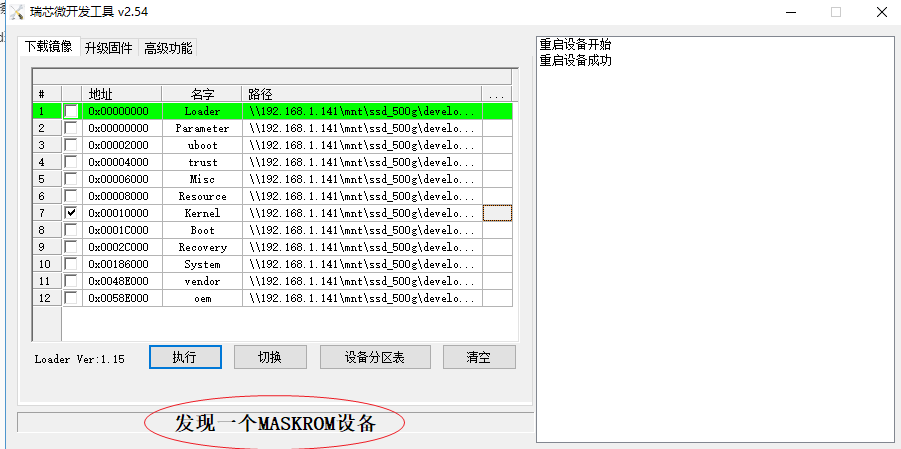

# 烧录操作（loader状态才可烧录）

## 使用type-c烧录操作

### 连接时状态

#### adb设备


#### loader设备


#### maskboot设备




#### 没有发现设备

### 烧录原理

单板通过usb连接发送adb命令给os（android,linux-qt），让其运行到loader状态，然后通过【瑞芯微开发工具 vx.xx】软件去发送相应的烧录命令给loader状态的uboot去解释、烧写相应的数据文件

```
adb reboot fastboot   //uboot进入此状态后,软件也会显示为adb设备

adb reboot loader    

adb reboot recovery
```


### 读取设备分区表

**<u>仅loader状态可读取</u>**

adb状态不可读取

fastboot状态不可读取


## qt环境擦除分区


操作步骤：

1.  adb reboot loader
2. 当显示上面发现一个LOADER设备后，点击执行即可

操作结果：可正常擦除kernel，擦除后启动停止在下图所示


### qt环境分区表

//QT下分区表信息:
[root@rk3399:/]# cat /proc/cmdline 
earlycon=uart8250,mmio32,0xff1a0000 swiotlb=1 consolse=ttyFIQ0 rootwait coherent_pool=1m root=/dev/mmcblk1p7 rw rootfstype=ext4 consoleblank=0 mtdparts=rk29xxnand:0x00002000@0x00002000(uboot),0x00002000@0x00004000(trust),0x00002000@0x00006000(misc),0x00006000@0x00008000(resource),0x00010000@0x0000e000(kernel),0x00010000@0x0001e000(boot),-@0x00030000(rootfs) lcd=HD702E,213dpi storagemedia=emmc uboot_logo=0x02000000@0xf5c00000 loader.timestamp=2019-09-03_15:52:05 SecureBootCheckOk=0 androidboot.mode=emmc


## android环境擦除分区


### boot分区替换成trust.img

此时串口将会停止启动，屏幕将会显示在Android Recovery状态


## 无法擦除情况验证

### 使用eflasher下载镜像：

通过sd卡启动烧录sd卡（16G）中百度网盘下载的eflash镜像，无法正常更新单个镜像文件，通过root用户在root系统下创建修改的文件，重启后会被还原

1. 烧录时是否选择disable overlay filesystem重启后都不会被保存
2. mount -o rw,remount /               #重新加载rootfs为可rw，重启后，修改会被还原
3. 使用开发工具也无法单独擦除kernel分区(将此分区镜像用其它的trust.img替换)

### 使用开发工具下载镜像:

环境说明：

​    编译的为userdebug版本，android系统未开启开发模式

1. mount -o rw,remount /               #重新加载rootfs为可rw，重启后，修改会被还原，**是否为开发者模式均无效**
2. 使用开发工具也可单独擦除kernel分区(将此分区镜像用其它的trust.img替换)
3. 

### 二者差异：

使用开发工具下载镜像，则可单独重烧镜像文件

# adb命令

adb reboot bootloader
adb reboot recovery

//anroid下重新挂载rootfs
mount -o rw,remount /

adb reboot bootloader
adb reboot recovery

进入开发者模式：
	设置》系统》关于平板电脑》版本号（点击三下）
	
	
//重新挂载system分区

adb root
adb disable-verity
adb reboot

adb root
adb remount


adb  reboot  fastboot
fastboot  flashing  unlock    # 设备解锁，开始刷机
fastboot oem unlock

//fastboot烧录操作记录
QT环境启动到fastboot，擦除kernel分区
>adb  reboot  fastboot
>fastboot erase kernel
>fastboot reboot
>上面命令执行成功，但并未擦除分区，仍可正常启动

//load下烧录
adb reboot loader

# 开发者模式

​	设置》系统》关于平板电脑》版本号（点击三下）